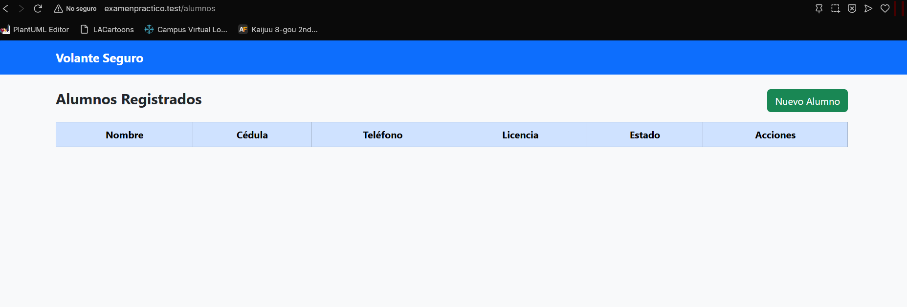
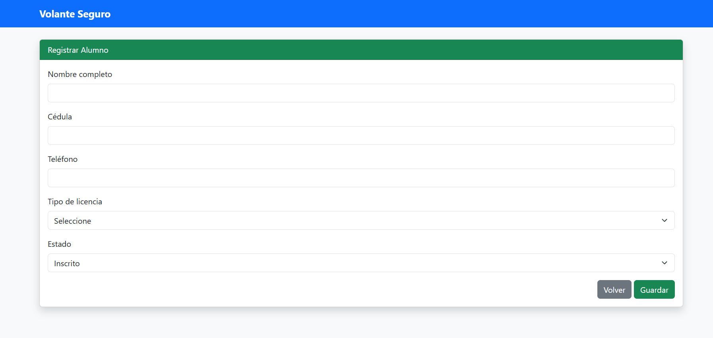
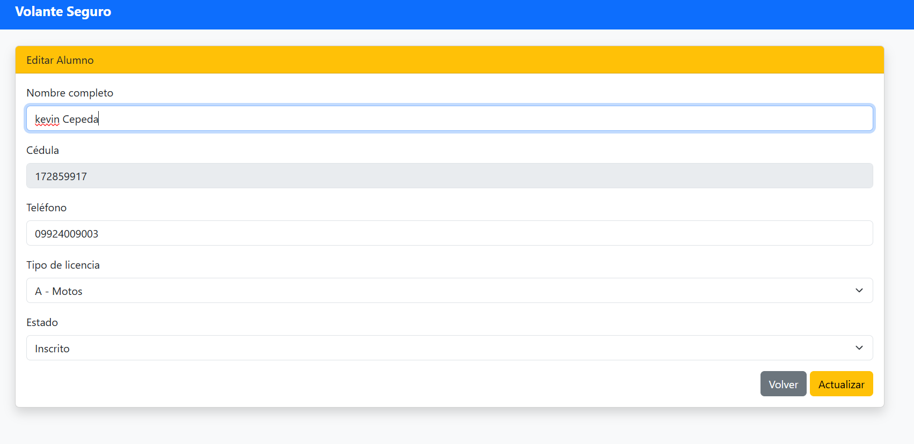

<h2>Arquitectura MVC</h2>

El proyecto fue desarrollado utilizando el patrón de arquitectura <strong>MVC (Modelo - Vista - Controlador)</strong>,
lo que permite separar claramente la lógica del negocio, la presentación y el control de datos.

<ul>
  <li><strong>Modelo (Model):</strong> Se encarga de la interacción con la base de datos.</li>
  <li><strong>Vista (View):</strong> Maneja la interfaz gráfica que ve el usuario.</li>
  <li><strong>Controlador (Controller):</strong> Gestiona la lógica y conecta el modelo con la vista.</li>
</ul>
<h2>   Capturas de como queda el MVC en el navegador</h2>

<h2>   Capturas de como queda la pagina rpincipal sin añadir nada</h2>
       
<h2>   Capturas de como queeda la lista con un ingreso</h2>
      
<h2>   Capturas de como es el formulario de ingreso</h2>
      
 <h2>   Capturas de como queda el formulario de ingreso</h2>
      

 <h2>Decisiones de Diseño</h2>

<ul>
  <li>No se eliminan registros de alumnos por temas legales.</li>
  <li>Se utiliza un campo <strong>estado</strong> para representar el avance del alumno.</li>
  <li>La fecha de inscripción se genera automáticamente.</li>
  <li>Se utiliza Bootstrap para asegurar compatibilidad móvil.</li>
</ul>

<h3>Modelo</h3>

El modelo <strong>Alumno</strong> representa la tabla <code>alumnos</code> en la base de datos y permite realizar
operaciones CRUD mediante Eloquent ORM.

<ul>
  <li>Define los campos que pueden ser llenados masivamente.</li>
  <li>Conecta directamente con la base de datos MySQL.</li>
</ul>

<h3>Controlador</h3>

El controlador <strong>AlumnoController</strong> gestiona la lógica del sistema, recibiendo las solicitudes del usuario,
procesando la información y retornando las vistas correspondientes.

<ul>
  <li><strong>index:</strong> Muestra el listado de alumnos.</li>
  <li><strong>create:</strong> Muestra el formulario de registro.</li>
  <li><strong>store:</strong> Guarda un nuevo alumno.</li>
  <li><strong>edit:</strong> Muestra el formulario de edición.</li>
  <li><strong>update:</strong> Actualiza los datos del alumno.</li>
</ul>

<h3>Base de Datos</h3>

La base de datos utilizada es <strong>MySQL</strong>. La tabla principal es <code>alumnos</code>,
creada mediante migraciones de Laravel.

<ul>
  <li>Nombre completo</li>
  <li>Cédula (única)</li>
  <li>Teléfono</li>
  <li>Tipo de licencia</li>
  <li>Estado del alumno</li>
  <li>Fecha de inscripción automática</li>
</ul>

<h2>Repositorio GitHub</h2>

El proyecto se encuentra alojado en un repositorio público en GitHub:

<a href="https://github.com/TU-USUARIO/academia-volante-seguro" target="_blank">
Repositorio del Proyecto
</a>

